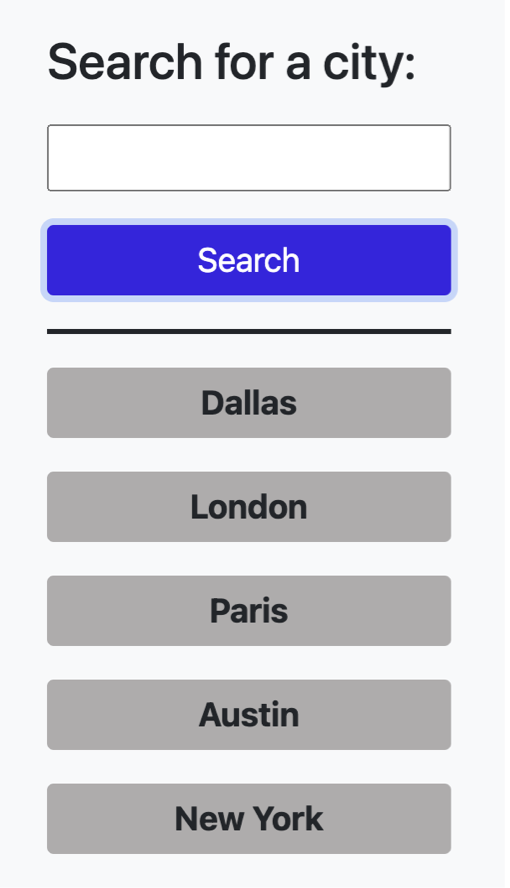

# Weather Dashboard

## Table of Contents

- [Features](#features)
- [Tecnologies](#tecnologies)
- [Website Picture](#weather-dashboard-page)
- [Contact Info](#contact-info)
- [License](#license)
- [Llinks](#links)

## Features:
This application uses the input entered to see the current and future weather conditions for a particular city. The weather dashboard allows you to see the weather for the next 5 days. This includes not only the temperature but also the wind speed, humidity and UV index! It even uses icons to better understand and visualize the weather. It also stores and displays the past 8 searches. They are displayed below the search button. You can access the weather of these pervious searches by clicking on them. 

 ## Tecnologies 

1. jQuery
2. CSS
3. HTML
4. Bootstrap
5. MomentJS
6. WeatherAPI (API used with these tecnologies)
 
 

  

 ## Weather dashboard page
 

## Contact Info 

KarenHarley88@gmail.com

## License

The license used for this project: MIT
 
## Links:
 

#### Github

https://github.com/KarenHarley/Weather-Dashboard

#### Website

https://karenharley.github.io/Weather-Dashboard
